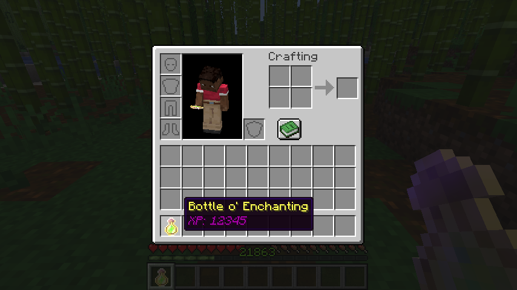
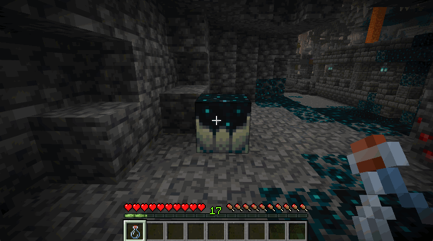
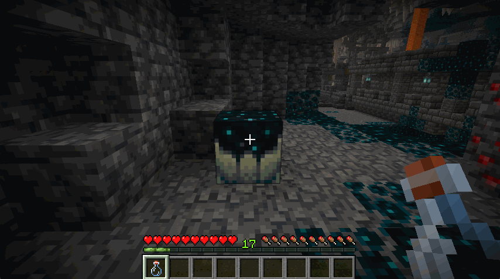

# XP Orb Extractor

![Language Java25]

[![Mod loader Fabric]][Fabric]

[![Requires Fabric API]][Fabric API]

XP Orb Extractor lets you customize Bottles o’ Enchanting to release a precise amount of experience orbs upon use,
instead of random drops.

To easily gather your XP into bottles, interact with a Sculk Catalyst using an empty glass bottle.

## Compatibility & Installation

Supports on [Fabric](https://fabricmc.net/use/) and requires [Fabric API][Fabric API].

This mod operates on the server, but includes client-facing assets, such as translations and sprites.

* **Server Side**: **Required** for the mod to function.
* **Client Side**: Optional. Thanks to the server’s Resource Pack Distribution feature, clients can automatically receive
  all necessary textures and localizations without manually installing the mod.
  [A pre-built resource pack (.zip) for the server can be found here](https://github.com/lonefelidae16/xp-orb-extractor/tree/main/resourcepack),
  named `xp-orb-extractor-server-pack.zip`.
* **Integrated Server** (Singleplayer): Fully supported.

## Features

* **Customized Bottles o’ Enchanting**: Creates Bottles o’ Enchanting that release a precise,
  specified amount of experience orbs upon breaking (powered by custom data).
* **Sculk Catalyst Integration**: Interact with a Sculk Catalyst using an empty glass bottle to capture
  your current experience points into a bottle on the spot.
* **Flexible Modes**: Choose between specific experience points or player levels as the target for bottling.
* **Fully Configurable**: Easily adjust settings and behavior in-game using dedicated commands.

[Commands and settings specifications are available on the Wiki](https://github.com/lonefelidae16/xp-orb-extractor/wiki/).

[Language Java25]: https://img.shields.io/badge/language-Java%2025-orange?logo=data:image/svg%2bxml;base64,PHN2ZyB4bWxucz0iaHR0cDovL3d3dy53My5vcmcvMjAwMC9zdmciIHdpZHRoPSI2NCIgaGVpZ2h0PSI2NCIgdmlld0JveD0iMCAwIDMyIDMyIj48cGF0aCBkPSJNMTEuNjIyIDI0Ljc0cy0xLjIzLjc0OC44NTUuOTYyYzIuNTEuMzIgMy44NDcuMjY3IDYuNjI1LS4yNjdhMTAuMDIgMTAuMDIgMCAwIDAgMS43NjMuODU1Yy02LjI1IDIuNjcyLTE0LjE2LS4xNi05LjI0NC0xLjU1em0tLjgtMy40NzNzLTEuMzM2IDEuMDE1Ljc0OCAxLjIzYzIuNzI1LjI2NyA0Ljg2Mi4zMiA4LjU1LS40MjdhMy4yNiAzLjI2IDAgMCAwIDEuMjgyLjgwMWMtNy41MzQgMi4yNDQtMTUuOTc2LjIxNC0xMC41OC0xLjYwM3ptMTQuNzQ3IDYuMDlzLjkwOC43NDgtMS4wMTUgMS4zMzZjLTMuNTggMS4wNy0xNS4wMTQgMS4zOS0xOC4yMiAwLTEuMTIyLS40OCAxLjAxNS0xLjE3NSAxLjctMS4yODIuNjk1LS4xNiAxLjA3LS4xNiAxLjA3LS4xNi0xLjIzLS44NTUtOC4xNzUgMS43NjMtMy41MjYgMi41MSAxMi43NyAyLjA4NCAyMy4yOTYtLjkwOCAxOS45ODMtMi40MDR6TTEyLjIgMTcuNjMzcy01LjgyNCAxLjM5LTIuMDg0IDEuODdjMS42MDMuMjE0IDQuNzU1LjE2IDcuNjk0LS4wNTMgMi40MDQtLjIxNCA0LjgxLS42NCA0LjgxLS42NHMtLjg1NS4zNzQtMS40NDMuNzQ4Yy01LjkzIDEuNTUtMTcuMzEyLjg1NS0xNC4wNTItLjc0OCAyLjc3OC0xLjMzNiA1LjA3Ni0xLjE3NSA1LjA3Ni0xLjE3NXptMTAuNDIgNS44MjRjNS45ODQtMy4xIDMuMjA2LTYuMDkgMS4yODItNS43MTctLjQ4LjEwNy0uNjk1LjIxNC0uNjk1LjIxNHMuMTYtLjMyLjUzNC0uNDI3YzMuNzk0LTEuMzM2IDYuNzg2IDQuMDA3LTEuMjMgNi4wOSAwIDAgLjA1My0uMDUzLjEwNy0uMTZ6bS05LjgzIDguNDQyYzUuNzcuMzc0IDE0LjU4Ny0uMjE0IDE0LjgtMi45NCAwIDAtLjQyNyAxLjA3LTQuNzU1IDEuODctNC45MTYuOTA4LTExLjAwNy44LTE0LjU4Ny4yMTQgMCAwIC43NDguNjQgNC41NDIuODU1eiIgZmlsbD0iIzRlNzg5NiIvPjxwYXRoIGQ9Ik0xOC45OTYuMDAxczMuMzEzIDMuMzY2LTMuMTUyIDguNDQyYy01LjE4MyA0LjExNC0xLjE3NSA2LjQ2NSAwIDkuMTM3LTMuMDQ2LTIuNzI1LTUuMjM2LTUuMTMtMy43NC03LjM3M0MxNC4yOTQgNi44OTMgMjAuMzMyIDUuMyAxOC45OTYuMDAxem0tMS43IDE1LjMzNWMxLjU1IDEuNzYzLS40MjcgMy4zNjYtLjQyNyAzLjM2NnMzLjk1NC0yLjAzIDIuMTM3LTQuNTQyYy0xLjY1Ni0yLjQwNC0yLjk0LTMuNTggNC4wMDctNy41ODcgMCAwLTEwLjk1MyAyLjcyNS01LjcxNyA4Ljc2M3oiIGZpbGw9IiNmNTgyMTkiLz48L3N2Zz4=

[Fabric]: https://fabricmc.net
[Mod loader Fabric]: https://img.shields.io/badge/modloader-Fabric-ffffd0?logo=data:image/png;base64,iVBORw0KGgoAAAANSUhEUgAAACAAAAAgCAYAAABzenr0AAAACXBIWXMAAAsTAAALEwEAmpwYAAAFHGlUWHRYTUw6Y29tLmFkb2JlLnhtcAAAAAAAPD94cGFja2V0IGJlZ2luPSLvu78iIGlkPSJXNU0wTXBDZWhpSHpyZVN6TlRjemtjOWQiPz4gPHg6eG1wbWV0YSB4bWxuczp4PSJhZG9iZTpuczptZXRhLyIgeDp4bXB0az0iQWRvYmUgWE1QIENvcmUgNS42LWMxNDIgNzkuMTYwOTI0LCAyMDE3LzA3LzEzLTAxOjA2OjM5ICAgICAgICAiPiA8cmRmOlJERiB4bWxuczpyZGY9Imh0dHA6Ly93d3cudzMub3JnLzE5OTkvMDIvMjItcmRmLXN5bnRheC1ucyMiPiA8cmRmOkRlc2NyaXB0aW9uIHJkZjphYm91dD0iIiB4bWxuczp4bXA9Imh0dHA6Ly9ucy5hZG9iZS5jb20veGFwLzEuMC8iIHhtbG5zOmRjPSJodHRwOi8vcHVybC5vcmcvZGMvZWxlbWVudHMvMS4xLyIgeG1sbnM6cGhvdG9zaG9wPSJodHRwOi8vbnMuYWRvYmUuY29tL3Bob3Rvc2hvcC8xLjAvIiB4bWxuczp4bXBNTT0iaHR0cDovL25zLmFkb2JlLmNvbS94YXAvMS4wL21tLyIgeG1sbnM6c3RFdnQ9Imh0dHA6Ly9ucy5hZG9iZS5jb20veGFwLzEuMC9zVHlwZS9SZXNvdXJjZUV2ZW50IyIgeG1wOkNyZWF0b3JUb29sPSJBZG9iZSBQaG90b3Nob3AgQ0MgMjAxOCAoV2luZG93cykiIHhtcDpDcmVhdGVEYXRlPSIyMDE4LTEyLTE2VDE2OjU0OjE3LTA4OjAwIiB4bXA6TW9kaWZ5RGF0ZT0iMjAxOS0wNy0yOFQyMToxNzo0OC0wNzowMCIgeG1wOk1ldGFkYXRhRGF0ZT0iMjAxOS0wNy0yOFQyMToxNzo0OC0wNzowMCIgZGM6Zm9ybWF0PSJpbWFnZS9wbmciIHBob3Rvc2hvcDpDb2xvck1vZGU9IjMiIHBob3Rvc2hvcDpJQ0NQcm9maWxlPSJzUkdCIElFQzYxOTY2LTIuMSIgeG1wTU06SW5zdGFuY2VJRD0ieG1wLmlpZDowZWRiMWMyYy1mZjhjLWU0NDEtOTMxZi00OTVkNGYxNGM3NjAiIHhtcE1NOkRvY3VtZW50SUQ9InhtcC5kaWQ6MGVkYjFjMmMtZmY4Yy1lNDQxLTkzMWYtNDk1ZDRmMTRjNzYwIiB4bXBNTTpPcmlnaW5hbERvY3VtZW50SUQ9InhtcC5kaWQ6MGVkYjFjMmMtZmY4Yy1lNDQxLTkzMWYtNDk1ZDRmMTRjNzYwIj4gPHhtcE1NOkhpc3Rvcnk+IDxyZGY6U2VxPiA8cmRmOmxpIHN0RXZ0OmFjdGlvbj0iY3JlYXRlZCIgc3RFdnQ6aW5zdGFuY2VJRD0ieG1wLmlpZDowZWRiMWMyYy1mZjhjLWU0NDEtOTMxZi00OTVkNGYxNGM3NjAiIHN0RXZ0OndoZW49IjIwMTgtMTItMTZUMTY6NTQ6MTctMDg6MDAiIHN0RXZ0OnNvZnR3YXJlQWdlbnQ9IkFkb2JlIFBob3Rvc2hvcCBDQyAyMDE4IChXaW5kb3dzKSIvPiA8L3JkZjpTZXE+IDwveG1wTU06SGlzdG9yeT4gPC9yZGY6RGVzY3JpcHRpb24+IDwvcmRmOlJERj4gPC94OnhtcG1ldGE+IDw/eHBhY2tldCBlbmQ9InIiPz4/HiGMAAAAtUlEQVRYw+XXrQqAMBQF4D2P2eBL+QIG8RnEJFaNBjEum+0+zMQLtwwv+wV3ZzhhMDgfJ0wUSinxZUQWgKos1JP/AbD4OneIDyQPwCFniA+EJ4CaXm4TxAXCC0BNHgLhAdAnx9hC8PwGSRtAFVMQjF7cNTWED8B1cgwW20yfJgAvrssAsZ1cB3g/xckAxr6FmCDU5N6f488BrpCQ4rQBJkiMYh4ACmLzwOQF0CExinkCsvw7vgGikl+OotaKRwAAAABJRU5ErkJggg==

[Requires Fabric API]: ./md-resource/images/requires-fabric-api.png
[Fabric API]: https://modrinth.com/mod/fabric-api

[Latest build on GitHub]: https://img.shields.io/github/v/tag/lonefelidae16/xp-orb-extractor?logo=github&logoColor=black&label=latest&labelColor=whitesmoke&color=plum
